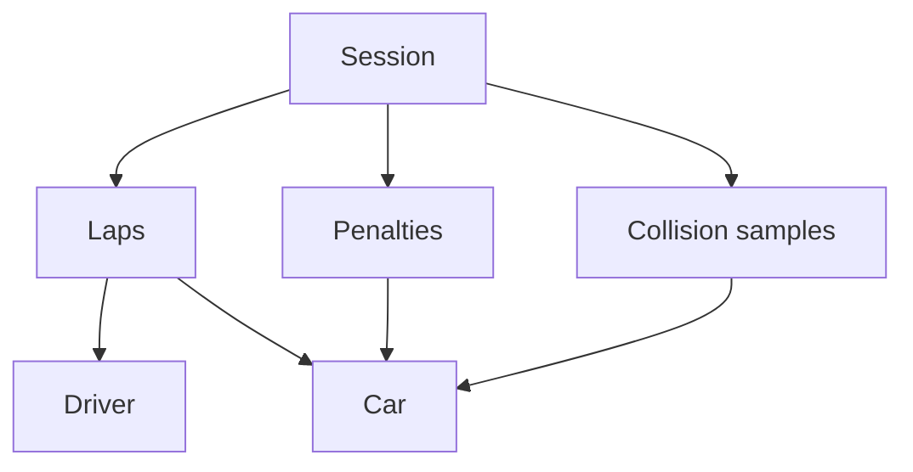
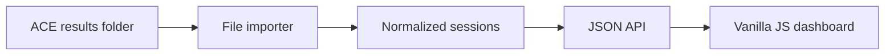

# ACE Results Data and Dashboard Architecture

## Overview

The Assetto Corsa EVO results JSON contains enough data to build a useful session dashboard, but it needs a normalization layer first. The raw export is structured more like game/server state than dashboard-ready data.

This document describes the available data, known quirks, a proposed normalized model, and a high-level vanilla JavaScript dashboard architecture designed to run in Docker.

ACE creates one results file when a session completes. The dashboard should therefore treat these exports as immutable, append-only session snapshots rather than a source of live telemetry.

## Data included in the results JSON

| Area | Fields | Dashboard use |
| --- | --- | --- |
| Session identity | `server_name`, `server_id`, `server_ip`, `season_guid` | Identify and group imported sessions |
| Session details | `session_name`, `session_type`, `is_completed` | Practice/race labeling and status |
| Circuit | `track_name`, `track_layout_name` | Report title and filtering |
| Sequence | `event_index`, `session_index` | Order sessions within championships or events |
| Configuration | `specialization` | Duration, lap limits, rules, and penalty configuration |
| Drivers | `drivers` | Names, nicknames, nation, player ID, and birth year |
| Cars | `cars` | Model, race number, and performance indicator |
| Results | `driver_standings`, `car_standings`, `time_standings` | Exporter-provided finishing order |
| Laps | `laps` | Lap time, driver, car, flags, and splits |
| Contacts | `collisions` | Impact speed, object type, damage, position, and timestamp |
| Penalties | `penalty_collection` | Issued, pending, and cleared penalties |
| Championship scoring | `driver_points`, `car_points` | Empty in the supplied practice sessions |

### Session configuration

The `specialization` object indicates that the supplied session was configured as a time-attack-style session:

- Three-hour session duration: `10,800,000 ms`
- No fixed lap count
- Ten-second overtime configuration
- Custom penalty rules
- Pit-lane speed check at 60
- Wrong-way and track-cut investigation configuration

Most of this belongs in an expandable **Session configuration** panel rather than the primary dashboard.

## Data relationships

The game uses composite IDs with two large integer components:

```json
{
  "a": "5668498424109981672",
  "b": "6185062481106307470"
}
```

Both halves must be treated as a single identifier. They can be normalized into a JavaScript string:

```js
function compositeId(value) {
  return `${value.a}:${value.b}`;
}
```



A lap connects directly to both a driver and car:

- `lap.driver_key` → `driver.guid`
- `lap.car_key` → `car.car_id`

Contacts and penalties connect to a car rather than directly to a driver:

- `collision.car_id` → `car.car_id`
- `session_penalty.car_id` → `car.car_id`

The association between drivers and cars can be reconstructed from the standing arrays, which appear to be positionally aligned:

```text
driver_standings[0]
car_standings[0]
time_standings[0]
```

Because positional indexing is brittle, the importer should convert these arrays into explicit driver-car entries.

## Important quirks and limitations

The raw fields should not all be trusted equally:

- `time_standings` omitted Luke's completed `7:37.110`, even though the lap exists in `laps`.
- `drivers` contains Luke twice because he appears with two cars.
- Several `car_standings` metrics are zero, including distance and fuel.
- The later supplied session contains one driver and car but no completed laps.
- `collisions` contains 717 records, but these are sampled contact records rather than 717 distinct crashes.
- Lap `flags` values are present, but the meanings of `1` and `2` should not be assumed without documentation or additional samples.
- Times and timestamps use a mixture of integers, decimals, and numeric strings.

Rankings and personal-best calculations should be derived directly from `laps`. The `time_standings` array should be treated as supporting exporter data rather than the authoritative source.

Sensitive fields such as `server_ip`, player or Steam IDs, and birth years should be removed from any publicly accessible API response unless specifically required.

## Proposed normalized model

Every raw export should be converted into a stable internal representation before rendering:

```js
{
  id: "derived-session-id",
  track: {
    name: "Nurburgring",
    layout: "Touristenfahrten"
  },
  session: {
    name: "Practice",
    type: "Practice",
    completed: true,
    durationMs: 10800000
  },
  entries: [
    {
      id: "driver-id:car-id",
      driver: {
        id: "...",
        nickname: "morphy"
      },
      car: {
        id: "...",
        model: "Porsche 911 GT3 RS (992)",
        number: 1
      },
      laps: [
        { number: 1, timeMs: 416835, flags: 1 },
        { number: 2, timeMs: 409500, flags: 2 }
      ],
      bestLapMs: 409500,
      completedLapCount: 2,
      gapToBestMs: 0,
      averageLapMs: 413168,
      lapRangeMs: 7335,
      contacts: {
        sampleCount: 144,
        damagingSampleCount: 109,
        maximumImpactKmh: 143.5
      },
      penalties: []
    }
  ],
  leaderGapMs: 47610
}
```

This normalized shape becomes the contract between the importer and dashboard. If ACE changes its export format, only the importer should need to change.

### Pace metric definitions

Pace metrics are computed server-side in the normalizer and exposed as nullable numeric fields in milliseconds. The frontend is responsible for formatting them for display.

| Field | Definition |
| --- | --- |
| `completedLapCount` | Number of recorded completed laps for the entry |
| `bestLapMs` | Minimum completed-lap time for the entry; `null` when zero laps |
| `gapToBestMs` | Entry best lap minus session best lap; `null` when the entry has no laps |
| `averageLapMs` | Sum of completed-lap times divided by count, rounded to the nearest millisecond; `null` when zero laps |
| `lapRangeMs` | Slowest completed lap minus fastest completed lap; `null` when fewer than two laps |
| `leaderGapMs` | Second-fastest classified entry's best lap minus fastest classified entry's best lap; `null` when fewer than two entries have completed laps |

All recorded completed laps are included in these calculations regardless of lap flag value. Flag semantics are unverified and no validity filter is applied. The calculation code is structured so a verified validity filter can be introduced later without rewriting the UI.

### Leader gap behavior

The leader gap represents the time difference between P1 and P2. It is calculated from normalized entry best laps, not from `time_standings`. Driver/car combinations are treated as separate entries. When fewer than two entries have completed laps, the value is `null` and the frontend displays an em dash.

### Contact records versus incidents

ACE collision data consists of sampled contact records, not unique incidents. A sustained contact event can produce hundreds of samples. The dashboard:

- Presents contact data as supporting diagnostics, not as a primary performance measure.
- Uses the term **contact samples** rather than incidents or crashes.
- Does not cluster samples into inferred incidents.
- Does not rank drivers by safety or infer fault.
- Displays maximum impact speed, total sample count, and damaging sample count per entry.

This distinction is documented in the UI via explanatory text beneath the contact-data subsection.

## Dashboard layout

The PDF report provides a useful initial component system.

### 1. Header

Track, layout, session type, and date.

### 2. KPI strip

Best lap, completed laps, largest improvement, and leader gap.

### 3. Leaderboard

Rank, driver, car, and best lap.

### 4. Lap comparison

Every completed lap, sortable by time or chronological order.

### 5. Pace summary

One row per driver/car entry showing completed laps, best lap, gap to session best, average lap, and lap-time range. The session leader is highlighted with a restrained cyan accent. Entries without laps are visible but subdued.

### 6. Incidents & Penalties

An accessible disclosure panel containing:

- **Penalties** — actual ACE penalties with driver/car, investigation type, penalty type, penalty time, lap count, session time, and pending/cleared state.
- **Contact data** — per-entry maximum impact, total contact samples, and damaging sample count, with a note that samples are not necessarily unique incidents.

### 7. Future detail views

Driver history, car history, lap consistency, and collision-location maps.

The desktop layout:

```text
Header
[KPI] [KPI] [KPI] [KPI]

[ Leaderboard       ] [ Completed laps         ]
[                   ] [                         ]
[                   ] [ Pace summary            ]

Session history

[Incidents & Penalties ▾]
```

On mobile, the panels should collapse into one vertical column.

## Recommended application architecture

The baseline application should include a small Node.js ingestion and API service. The browser interface remains entirely vanilla JavaScript; Node is responsible only for watching files, normalizing results, storing derived data, and serving the application.



This is a better fit than a purely static Nginx site because it allows new completed sessions to appear automatically without manually updating a session manifest.

### Responsibilities

The Node service should:

- Watch a bind-mounted ACE results directory.
- Periodically rescan the directory as a fallback.
- Wait until each new file has stopped changing before reading it.
- Parse and validate the raw JSON.
- Normalize ACE-specific structures into the dashboard model.
- Deduplicate imported files using a content hash.
- Preserve the original exports unchanged.
- Serve the static HTML, CSS, and JavaScript.
- Expose normalized session data through a small JSON API.

## Proposed vanilla JavaScript project structure

```text
ace-dashboard/
├── Dockerfile
├── compose.yaml
├── package.json
├── server/
│   ├── server.js
│   ├── importer.js
│   ├── normalizer.js
│   └── session-store.js
├── public/
│   ├── index.html
│   ├── assets/
│   │   └── styles.css
│   └── js/
│       ├── app.js
│       ├── api.js
│       ├── formatters.js
│       └── components/
│           ├── header.js
│           ├── kpi-cards.js
│           ├── leaderboard.js
│           ├── lap-chart.js
│           ├── pace-summary.js
│           ├── incidents-panel.js
│           └── session-history.js
└── data/
    ├── results/
    │   └── results_YYYYMMDD_HHMMSS_practice.json
    └── normalized/
        ├── sessions.json
        └── sessions/
            └── session-id.json
```

Each component can be a small function that creates DOM elements without introducing a framework:

```js
export function createKpiCard({ label, value, detail }) {
  const card = document.createElement("article");
  card.className = "kpi-card";

  card.innerHTML = `
    <span class="kpi-card__label"></span>
    <strong class="kpi-card__value"></strong>
    <span class="kpi-card__detail"></span>
  `;

  card.querySelector(".kpi-card__label").textContent = label;
  card.querySelector(".kpi-card__value").textContent = value;
  card.querySelector(".kpi-card__detail").textContent = detail;

  return card;
}
```

Using `textContent` for imported values prevents player names or server metadata from being interpreted as injected HTML.

## Ingestion lifecycle

Each result file represents one completed session. The importer should process files as follows:

1. Discover a new `.json` file through a filesystem notification or periodic scan.
2. Wait briefly and verify that its size and modification time have stopped changing.
3. Read and validate the JSON without modifying the source file.
4. Calculate a SHA-256 hash of the file contents.
5. Skip the import if that hash has already been processed.
6. Normalize the session into the internal dashboard model.
7. Write the normalized session and update the session index.
8. Make the new session available through the API.

Filesystem notifications should not be the only discovery mechanism. Notifications from Docker bind mounts can be inconsistent across host platforms, so the service should also scan the results directory:

- When the application starts
- At a modest recurring interval
- After a filesystem notification

Malformed or incomplete files should be logged and quarantined for retry rather than crashing the service. Sessions containing no completed laps remain valid session records and should still be imported.

## Session identity and deduplication

Each normalized session should include an internal ID and source metadata:

```js
{
  id: "sha256-of-file-content",
  source: {
    filename: "results_20260904_153745_practice.json",
    importedAt: "2026-09-04T15:38:00Z",
    fileModifiedAt: "2026-09-04T15:37:45Z"
  }
}
```

The content hash provides reliable deduplication even if a result file is copied or renamed. The source filename and timestamps remain available for display and troubleshooting.

## Initial API

The first API can remain intentionally small:

```text
GET /api/health
GET /api/sessions
GET /api/sessions/:id
GET /api/drivers
GET /api/tracks
```

The session-list endpoint should return lightweight summaries. The individual-session endpoint can return the full normalized session, including laps, contact metrics, and penalties.

## Storage strategy

Normalized JSON files and a generated index are sufficient for the initial version:

```text
data/normalized/
├── sessions.json
└── sessions/
    ├── abc123.json
    └── def456.json
```

SQLite becomes worthwhile when the dashboard needs:

- Cross-session driver statistics
- Personal-best history
- Track and car filtering across many sessions
- Hundreds or thousands of sessions
- Driver aliases or corrections
- More efficient aggregate queries

The normalization boundary should remain the same whether storage is JSON or SQLite.

## Docker direction

The initial container should run the lightweight Node service, which serves both the static application and JSON API:

- No database is required initially.
- The ACE results directory should be mounted read-only.
- Normalized dashboard data should use a separate writable volume.
- New result files should be imported without rebuilding or restarting the image.

Conceptual Compose configuration:

```yaml
services:
  dashboard:
    build: .
    ports:
      - "8080:8080"
    volumes:
      - /path/to/ace/results:/app/data/results:ro
      - dashboard-data:/app/data/normalized

volumes:
  dashboard-data:
```

The service can run as a non-root user and should expose only its HTTP port. Sensitive raw fields such as server IP addresses, player IDs, and birth years should be excluded from public API responses.

## Completed results versus live timing

The architecture should explicitly distinguish historical results from live timing:

- **Version 1:** Completed-session history derived from result files
- **Future:** Live timing supplied by a separate server or telemetry interface

Because a result file appears only after its session finishes, it cannot power a live leaderboard. Future live data should enter through a separate adapter and should not change the completed-session import format.

## Suggested build order

1. Create the Node server and static vanilla JavaScript shell.
2. Build and test the ACE JSON normalizer using the supplied sample files.
3. Render one selected session using the PDF as the visual specification.
4. Add safe directory scanning, file-stability checks, and hash-based deduplication.
5. Add the session index and multi-session history views.
6. Add drag-and-drop as an optional manual import path.
7. Decide when cross-session querying justifies SQLite.

## Core design decision

Treat the PDF as the **visual specification** and the normalized session object as the **data specification**. Treat the ACE results directory as an **append-only source of completed sessions**. These boundaries keep the presentation independent of ACE's raw format, allow automatic imports, and leave room for SQLite or live timing later without rewriting the frontend.
